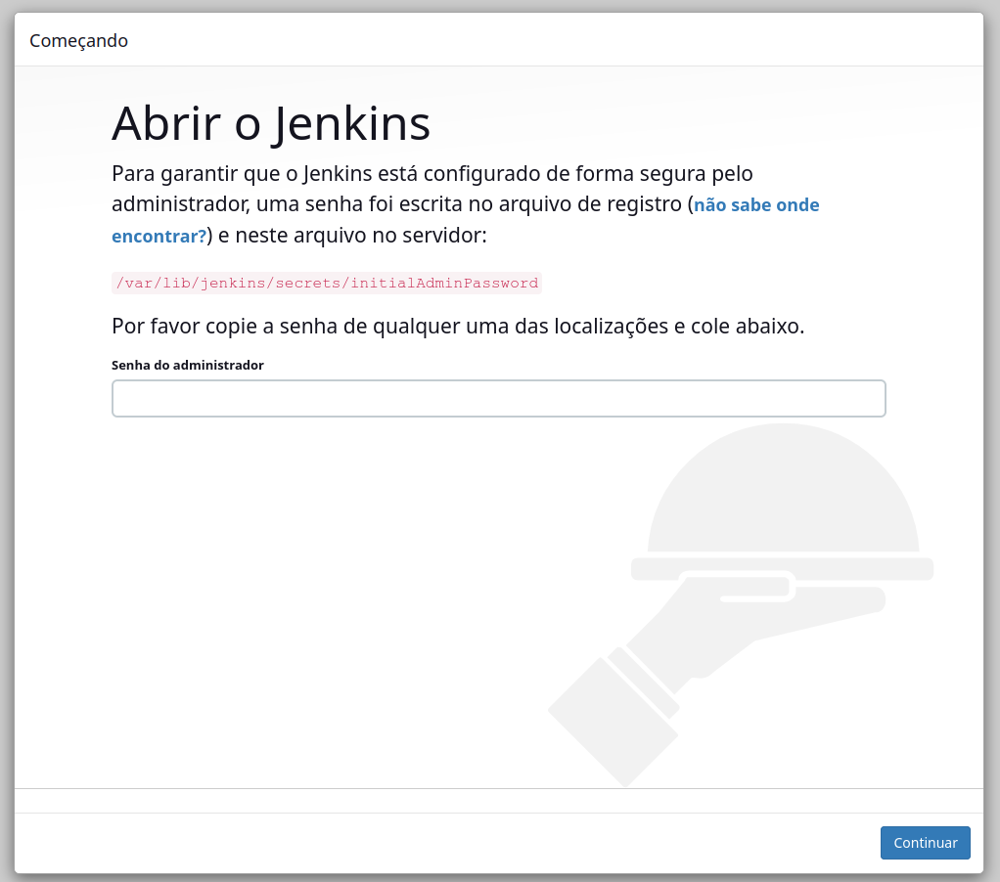

# Jenkis e Microk8s com Vagrant

Para iniciar o projeto sega as etapas abaixo:

```
$ git clone https://github.com/joao-prs/vagrantfiles.git
$ cd vagrantfiles/jenkins/
$ vagrant up --no-provision
$ vagrant up --provision
```

```
$ scp -o StrictHostKeyChecking=no vagrant@192.168.121.11:~/config .
$ scp -o StrictHostKeyChecking=no vagrant@192.168.121.10:~/pass .
```
User a senha do arquivo pass para fazer a primeira autenticação no jenkins

```
$ cat pass
b8341d52a4e440c3b6a8d332c0001c03
```


Emquanto o quivo config conten as crdenciais da api do microk8s:
```
$ export KUBECONFIG=config
$ kubectl get all -A
```


### Links

* https://github.com/madson7
* https://www.linkedin.com/pulse/cicd-pipeline-using-integration-jenkins-kubernetes-mukul-kumar/
* 


### requerimentos minimos para jenkins

Minimum hardware requirements:

256 MB of RAM
1 GB of drive space (although 10 GB is a recommended minimum if running Jenkins as a Docker container)

Recommended hardware configuration for a small team:

4 GB+ of RAM
50 GB+ of drive space